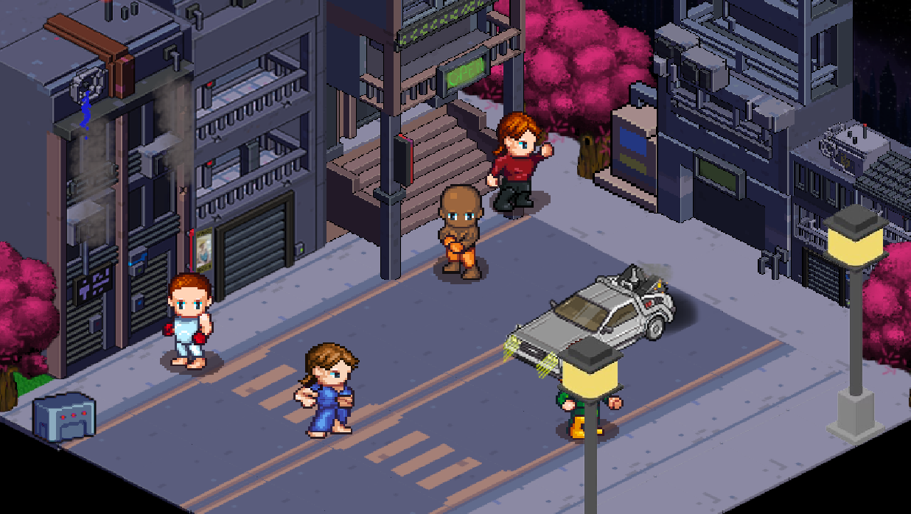

# Cyberdon

Cyberdon is an isometric RPG game developed with CSFML. In this game, you explore a cybernetic world, complete quests, fight enemies, and upgrade your skills.





## Game Features

- **Isometric View**: Immerse yourself in a 2.5D world with isometric graphics.
- **Quests and Missions**: Complete various quests to progress through the story and uncover the secrets of Cyberdon.
- **Strategic Combat**: Engage in battles that require strategy and skill.
- **Skill Upgrades**: Improve your character's abilities and unlock new powers.

## Dependencies

To run the game, you need to have the following dependencies installed on your system:
- CSFML
- CMake (for building the project)
- GCC or Clang (for compiling the source code)

## Installation

To run the game, you need to have CSFML installed on your system.

1. Clone the repository:
   ```sh
   git clone https://github.com/pierrelissope/cyberdon.git
   cd cyberdon
   ```
2. Build the game:
  ```sh
  make
  ```
3. Run the game:
  ```sh
  ./myrpg
  ```

## Controls

ZQSD: Move the character
Enter: Interact
E: Open inventory
Esc: Pause menu


## Contribution
If you want to contribute to the project, please fork the repository and submit a pull request. You can also open an issue if you find any bugs or have suggestions.


## License
This project is licensed under the MIT License. See the LICENSE file for more details.


## Acknowledgements
Thanks to the CSFML library for providing the tools necessary to build this game.
Special thanks to all the contributors and the open-source community.

Enjoy your adventure in Cyberdon!

